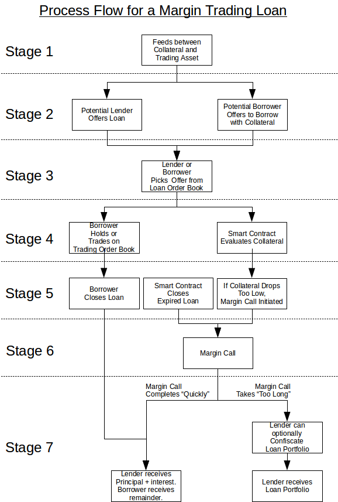

    BSIP: <BSIP number>
    Title: Lending for Margin Trading (Version A)
    Authors: George Harrap, Michel Santos
    Status: Draft
    Type: [ Informational | Protocol ]
    Created: 2019-04-29
    Discussion: <url>
    Worker: <Id of worker proposal> (optional)

# Abstract
# Motivation
# Rational
# Specifications

The process flow for margin trading is depicted below.  The process will be described as consisting of seven stages with some stages containing parallel processes.

1. [Stage 1](#process-price-feeds): Prior to any loan being offered or accepted, a price feed(s) must exist that can price the trading asset in terms of the collateral asset.
2. [Stage 2](#process-loan-offers): Lenders and potential Borrowers can place offers on the _Lending Order Book_.  The offers by lenders ("loan asks") and the offers by borrowers ("loan bids") will remain on the books until they either expire or are selected by account holders who are willing to accept those offers.
3. [Stage 3](#process-loan-matching): A reviewer of the Lending Order Book may select any existing offer.
4. [Stage 4a](#process-margin-trading): A borrower/margin trader may hold the borrowed asset and/or trade against the agreed-upon tradeable asset for the _duration of the loan offer_.  A borrower/margin trader may also update the amount of collateral in their loan. [Stage 4b](#process-loan-appraisal) While the loan is outstanding, the smart contract will appraise the loan to check whether sufficient collateral backs the loan.
5. [Stage 5a](#process-loan-closure-initiation): _A borrower_ may initiate a loan closure any time prior to the loan expiration.  [Stage 5b](#process-loan-expiration): _The smart contract_ may initiate a margin call when the loan expires.  [Stage 5c](#process-margin-call-initiation): _The smart contract_ may initiate a loan closure by margin call if appraises the loan's collateral as being too low.
6. [Stage 6](#process-margin-call): During a margin call process the smart contract attempts to liquidate a [loan portfolio](#process-margin-trading) by selling the balance of the tradeable asset on the market to obtain a sufficient balance of the borrowed asset to repay the lender.
7. [Stage 7a](#process-loan-closure): During a loan closure, the lender is repaid what is [owed](#debt-owed) and any balance of assets that remain in the [loan portfolio](#process-margin-trading) are transferred to the borrower's regular set of balances.  [Stage 7b](#process-portfolio-confiscation): Alternatively, if a margin call was initiated and does not complete within a certain amount of time, the lender may **optionally** confiscate the [loan portfolio](#process-margin-trading).

## 
 Stage 1: Price Feeds

Price feeds are essential for the smart contract to automatically appraise a lender's margin account during Stage 4 and to evaluate the need for a possible margin call.  The price feeds need to enable the smart contract to express the price of the tradeable asset in terms of the collateral asset.  This can require multiple combinations of price feeds.

---

**Example of Price Feeds**

If the tradable asset is bitBTC and the collateral asset is bitUSD price feeds will be required to express bitBTC in terms of bitUSD.  There are many potential exchange paths to accomplish this.
- A single price feed that expresses the price of bitBTC in terms of bitUSD (bitBTC/bitUSD)
- Two price feeds could also serve this purpose
	- One price feed expresses the price of bitBTC in terms of BTS (bitBTC/BTS)
	- One price feed expresses the price of bitUSD in terms of BTS (bitUSD/BTS)

---

- TBD: Which are the relevant price feeds?  Are they external price feeds or internal DEX feeds?
- TBD: What is the maximum age of the relevant price feeds?
- TBD: Who can determine the relevant price feeds, and maximum ages of price feeds?

## 
 Stage 2: Offers to Lend and Borrow

Both potential lenders and potential borrowers can place offers on Loan Order Book.  Potential lenders place "loan asks" and potential borrowers place "loan bids".  Offers to lend consist of the following conditions:

|Lending Offer Parameter|Description|
|-|-|
|
 Asset type to lend|The asset type that the lender is offering to lend|
|_Maximum_ amount to lend|The maximum amount of the asset type that the lender is offering|
|Asset type as collateral|The asset type that the borrower must provide for collateral.  _For this initial version of margin trading, this shall be the same asset type as the asset type to lend._|
|Maintenance collateral ratio (MCR)|The _minimum_ collateral ratio that is required from a borrower at the beginning of a loan.  MCR &ge; MCCR &ge; 1|
|Margin call collateral ratio (MCCR)|The _minimum_ collateral ratio below which [a margin call of the loan is initiated](#process-margin-call-initiation).  MCR &ge; MCCR &ge; 1|
|
 Asset type to trade against (Tradeable asset)|The asset type that the lender permits the borrower to trade against.  This restriction protects the lender from exit scam trading.|
|_Maximum_ duration of loan|The _maximum_ duration of the loan that the lender is willing to accept|
|Minimum interest rate|The _minimum_ daily interest rate that the lender is willing to accept|
|Expiration date|Expiration date of the offer|

|Borrowing Offer Parameter|Description|
|-|-|
|
 Asset type to borrow|The asset type that the borrower is seeking|
|_Maximum_ amount to borrow|The maximum amount of the asset type that the borrower is will borrow|
|Asset type as collateral|The asset type that the borrower must provide for collateral.  _For this initial version of margin trading, this shall be the same asset type as the asset type to lend._|
|Maintenance collateral ratio (MCR)|The _maximum_ collateral ratio that the borrower is willing to offer at the beginning of a loan.  MCR &ge; MCCR &ge; 1|
|Margin call collateral ratio (MCCR)|The _maximum_ collateral ratio below which [a margin call of the loan is initiated](#process-margin-call-initiation).  MCR &ge; MCCR &ge; 1|
|Asset type to trade against (Tradeable asset)|The asset type that the borrower can trade against.|
|_Minimum_ duration of loan|The _minimum_ duration of the loan that the borrower is willing to accept|
|_Maximum_ interest rate|The _maximum_ daily interest rate that the borrower is willing to accept|
|Expiration date|Expiration date of the offer|

After an offer is created, all users shall be able to identify:
- which unmatched offers are on the Lending Order Book, and
- which offers are matched.

Users shall have the ability to filter offers either by type (loan bid or loan ask), asset type to loan, tradeable asset type, amounts, interest rate, loan duration, maintenance collateral ratio, and margin call collateral ratio.  This capability shall either be done at the Core RPC-API node and/or at the user interface.  Offers to lend and offers to borrow shall have unique identifiers which can be referenced for [loan matching](#process-loan-matching).

The creation of offers, their partial and complete matches, their expiration, and their closures, shall be recorded as part of the account history of the lender and the borrower.

Offers to lend and borrow shall remain on the Loan Order Book until they either are canceled by the lender, expire, or are completely [matched](#process-loan-matching).

## 
 Stage 3: Loan Matching

_Matching of loans_, in this initial version of Lending for Margin Trading, _shall be an action taken by account holders who actively agree to specific loan offers by their offer identifier._  Automatic matching of offers on the Lending Order Book may be considered in a future BSIP.

When the agreement is matched, the borrower's collateral asset and the corresponding lender's loan asset shall be moved into the borrower's [loan-related portfolio](#process-margin-trading).

### Acceptance to Borrow

An acceptance to borrow, _which is techinically an acceptance of an existing lend offer_, shall be made by a borrower indicating the following in an operation:

|Agreement to Lending Offer Parameter|Description|
|-|-|
|Lending Offer ID|Identifier of an existing and open loan offer|

### Acceptance to Lend

An acceptance to lend, _which is technically an acceptance of an existing borrow offer_, shall be made by a lender indicating the following in an operation:

|Agreement to Borrow Offer Parameter|Description|
|-|-|
|Borrow Offer ID|Identifier of an existing and open offer to borrow|

### Amount of Loan

The amount of collateral (K) that is provided by the borrower shall be greater than or equal to the product of maintenance collateral ratio (MCR) required by the lender with the principal amount (P) that is provided by the lender.

K &ge; MCR &times; P

---

**Example of Matching a Loan Offer**

A potential lender offers to lend 70 bitUSD with an maintenance collateral ratio of 42.9%.  A borrower accepts the terms by offering 30.03 bitUSD as maintenance collateral.

The offer and acceptance will be matched, and the borrower's loan-related portfolio is opened with a total of 100.03 bitUSD.

---

---

**Example of Matching a Borrow Offer**

A potential borrower offers to borrow with 15 bitUSD collateral with an maintenance collateral ratio of 30%.  A lender accepts the terms by offering 50 bitUSD as financing.

The offer and acceptance will be matched, and the borrower's loan-related portfolio is opened with a total of 65.00 bitUSD.

---

### 
 Duration of Accepted Loan

The duration of the accepted loan shall be the duration that was specified in the offer.  Acceptance of a loan duration that is shorter than the offer may be considered in a future BSIP.

The start date of the loan shall be when the loan is matched.  The end date of the loan shall be calculated by adding the duration to the start date.  The loan may be closed:

- [by the borrower before the end date](#process-loan-closure),
- [by the smart contract when the end date arrives](#process-loan-expiration), or
- [by the smart contract before the end date if the loan portfolio is undervalued](#process-margin-call-initiation).

### Filling of Loan Offers

Filling of offers shall require, in this initial version of Lending for Margin Trading, complete fulfillment of an offer and shall not permit partial filling.  Partial filling of offers on the Lending Order Book may be considered in a future BSIP.

## 
 Stage 4a: Margin Trading within Loan Portfolio

Assets that are borrowed shall be placed into the borrower's margin trading "loan portfolio".  _This portfolio shall only be used for trading on the decentralized exchange in the market pair consisting of the ["Asset type to lend/borrow"](#lend-asset) and the ["Asset type to trade against"](#tradeable-asset).  It shall not be possible to transfer funds to any account, nor use any of the assets as collateral to create another pegged asset on BitShares._

Any assets obtained from trading shall by placed into the loan portfolio and shall also be restricted to trading between the pair of asset types defined in the loan agreement.

### Multiple Loan Portfolios

A borrower may have multiple outstanding loans each with their own distinct loan portfolio.  Trading of assets from each loan portfolio shall be independent of other loan portfolios that are controlled by the borrower.  Trade orders shall only draw from assets within a single loan portfolio.

The distinction of loan portfolios from each other are intended to segregate the risk of each loan which can have separate loan durations, margin collateral ratios, and tradeable assets.  This segregation should better secure the lenders than a single co-mingled loan portfolio.

User interfaces that facilitate trading for a borrower may optionally aggregate multiple loan portfolios into a single "margin trading wallet" to disguise the fact that multiple loan portfolios are being tracked.

## 
 Stage 4b: Appraisal of Loan Portfolio

### 
 Triggering of Appraisal

TBD: This must be carefully considered because there is the potential of overburdening each node with expensive appraisal calculations.

### 
 Debt Owed

The debt owed by a borrower (D) for a particular loan shall be a function of the number of days (d), rounded up to the next higher integer, that have elapsed since the loan was matched.  The number of days will then be used to calculate the total amount on the principal (P) as a result of a daily compound interest

D = P &times; (1 + Rdaily)d

where Rdaily is daily interest rate.

The total debt owed is the sum of the principal (P) and the interest (I).

D = P + I

The interest portion alone can be expressed as

I = P &times; (1 + Rdaily)d - P

---

**Example of Debt and Interest Calculation**

Bob borrowed 70 bitUSD 203.3 days ago at a daily interest rate of 0.0261% (which is approximately equivalent to 10% annual percentage rate).

The number of days of interest owed will be rounded up to 204 days.  The total amount owed is

D = 70 bitUSD &times; (1 + 0.000261)204 = 73.8276 bitUSD

The interest owed is the total amount owed minus the principal.

I = 70 bitUSD &times; (1 + 0.000261)204 - 70 bitUSD = 3.8276 bitUSD

---

### 
 Portfolio Appraisal

A borrower may have many outstanding loans which are owed to different borrowers.  Each [loan portfolio](#process-margin-trading) will _initially_ consist of the principal that is lent by the lender plus the initial collateral that is provided by the borrower.  The borrowed asset and the collateral asset shall initially be the same asset type.  After the loan is initiated, the borrower may use that asset type to trade for the loan-permitted asset type, and/or may hold the lent asset.  Therefore this loan-related portfolio may consist of balances of two asset types: the [borrowed asset type](#borrowed-asset), and the [tradeable asset type](#tradeable-asset).

The market price of the portfolio shall also be denominated in terms of the borrowed asset type for purposes of appraisal by the smart contract.  The market price of the borrower's loan-related portfolio shall consist of the market price of the two assets in the portfolio at the time of interest.
- The market price of the balance of the borrowed asset shall simply be the balance of the borrowed asset.
- The market price of the balance of the tradeable asset shall be denominated, by the smart contract with the use of [price feeds](#process-price-feeds), in the borrowed asset type.

---

**Example of Portfolio Appraisal**

Bob borrowed 70 bitUSD 203.3 days ago while supplying by supplying 30.03 bitUSD as collateral.  Bob has been margin trading with this loan portfolio against bitBTC and currently has a balance of 45 bitUSD and 0.025 bitBTC.  The current price feeds indicate that bitBTC is priced at 5000 bitUSD per bitBTC.  This loan portfolio will be appraised (PA) at:

PA = (45 bitUSD) + (0.025 bitBTC &times; 5000 bitUSD &div; bitBTC)

... = (45 bitUSD) + (125 bitUSD)

... = 170 bitUSD

---

### 
 Collateral Ratio

After [the calculation](#appraisal-triggers) of a [portfolio appraisal](#portfolio-appraisal) (PA) and the [debt owed](#debt-owed) (D), the collateral ratio (CR) shall be calculated as

CR = PA &div; D

At the beginning of the loan, the collateral ratio will satisfy the following conditions.

CR &ge; MCR &ge; MCCR &ge; 1

### 
 Derived Prices

The maintenance collateral price (MCP) of the loan portfolio is denominated in the [lent asset](#lend-asset) and equals

MCP = MCR &times; D

where D is the [debt owed](#debt-owed).

Similarly, the margin call collateral price (MCCP) of the loan portfolio is denominated in the [lent asset](#lend-asset) and equals

MCCP = MCCR &times; D

It is desired for the [appraised price of the portfolio](#portfolio-appraisal) (PA) to be greater than or equal this value

PA &ge; MCP &ge; MCCP &ge; D

but it is possible for this price to fall below the MCP.  If

PA &lt; MCCP

a [margin call shall be initiated](#process-margin-call-initiation).

## Stage 4: Status of Loan Portfolio

The [appraisal value](#portfolio-appraisal), [debt owed](#debt-owed), [collateral ratio](#collateral-ratio), and [derived prices](#derived-prices), and  of the portfolio shall be able to be queried by the lender and borrower at any time.

## Stage 4: Collateral Updates

A borrower shall be able to deposit additional collateral into the loan portfolio in the asset type of the collateral.

A borrower shall be able to withdraw **only the tradeable asset** as long as _the market price of the portfolio (PA) **after the withdrawal** is greater than or equal to the [maintenance collateral price](#derived-prices)_.

---

**Example of Withdrawal**

Bob borrowed 70 bitUSD 203.3 days ago at a daily interest rate of 0.0261% (which is approximately equivalent to 10% annual percentage rate) while supplying by supplying 30.03 bitUSD as collateral to satisfy the offer's 42.9% maintainance collateral ratio.

The number of days of interest owed will be rounded up to 204 days.  The total amount owed is

D = 70 bitUSD &times; (1 + 0.000261)204 = 73.8276 bitUSD

The [maintenance collateral price](#derived-prices) (MCP) of the portfolio is

MCP = MCR &times; D

... = 1.429 &times; 73.8276 bitUSD

... = 105.4996 bitUSD

During this time Bob has been margin trading with this loan portfolio against bitBTC and currently has a balance of 45 bitUSD and 0.025 bitBTC.  The current price feeds indicate that bitBTC is priced at 5000 bitUSD per bitBTC.  This loan portfolio will be appraised at:

L = (45 bitUSD) + (0.025 bitBTC &times; 5000 bitUSD &div; bitBTC)

... = (45 bitUSD) + (125 bitUSD)

... = 170 bitUSD

The borrower may withdraw up to _the equivalent in bitBTC_ (Wlimit) of

Wlimit = L - MCP

... = 170 bitUSD equivalent - 105.4996 bitUSD equivalent

... = 64.5004 bitUSD equivalent

... = (64.5004 bitUSD &div; (5000 bitUSD &div; bitBTC)

... = 0.01291 bitBTC

Since Bob has a balance of the tradeable asset, 0.025 bitBTC, that exceeds the withdrawal limit, he may withdraw up to the limit.  If the balance of the tradeable asset were, for example, only 0.1 bitBTC then Bob would only be able to withdraw 0.1 bitBTC.

---

## 
 Stage 5a: Initiation of Loan Closure by Borrower

A borrower may close an outstanding loan position by having a sufficient balance of the borrowed asset type in the loan-related portfolio and then initiating a loan closure with the appropriate parameters.

|Initiation of Loan Closure Parameter|Description|
|-|-|
|Lending Offer ID|Identifier of an existing and open loan offer|

The initiation of a loan closure shall close any and all open trade orders that are related to this loan.  If the balance of the borrowed asset type is insufficient to repay the prinicipal plus accrued interest then the initiation of the loan closure will be rejected.  _It is the responsibility of the borrower to ensure a sufficient balance in the borrowed asset type to repay the loan._

## 
 Stage 5b: Expiration of Loan

The smart contract shall initiate a [margin call](#process-margin-call) if an outstanding loan [expires](#loan-duration).

A future BSIP may consider automatically repaying the lender from available balances, and opening a new loan from any existing offers on the Loan Order Book.

## 
 Stage 5c: Initiation of Loan Closure by Margin Call

If the [collateral ratio](#collateral-ratio) ever drops below the margin call collateral ratio,

CR &lt; MCCR

the smart contract shall initiate a [margin call](#process-margin-call).

## 
 Stage 6: Margin Call

### Restriction of Loan Portfolio

When a margin call is initiated on a specific loan portfolio, no new market orders may be initiated that make use of any balance in the loan portfolio.  _Any other loan portfolios that the borrower might have shall not be affected by margin calls on other loans._

Any open market orders that are related to that specific loan portfolio shall be cancelled.

### Liquidation Plan

The smart contract shall determine whether the balance of the [borrowed asset](#borrowed-asset) is sufficient to pay what is [owed](#debt-owed).  If the balance is insufficient, the smart contract shall place an "effective" market order of the entire balance of the tradeable asset.  _The effective market order shall be performed by creating a limit order asking for one satoshi of the borrowed asset type in exchange for the entire balance of the tradeable asset_.

### Monitoring of Liquidation Plan

It shall be possible to monitor the status of the liquidation plan associated with any margin call.  An inquiry into the status of the liquidation plan shall return:
- how much of the [tradeable asset](#tradeable-asset) was originally being liquidated,
- how much of the [tradeable asset](#tradeable-asset) has been sold, and
- how much of the [borrowed asset](#borrowed-asset) has been obtained as a result of the liquidation.

### 
 Completion of Margin Call

The [loan-closure process](#process-loan-closure) shall begin after the liquidation plan is completed.

## 
 Stage 7a: Loan Closure

If loan closure was [initiated by the borrower](#process-loan-closure-initiation), the lender will be repaid what was [owed](#debt-owed) at the initiation.  If loan closure was initiated by the [completion of a margin call](#margin-call-completion), the lender will be repaid what was [owed](#debt-owed) at the commencement of the margin call process.

A future BSIP may consider re-lending a lenders balance by automatically creating a new offer on the Loan Order Book on behalf of the lender.

Any balances that remain in the loan portfolio shall be transferred to the borrower's regular set of balances and shall no longer be encumbered by any restrictions.

## 
 Stage 7b: Portfolio Confiscation

TBD

## 
 Definable Loan Constraints

TBD shall be able to define parameters that can constrain new loans:

|Term|Description|
|-|-|
|Maximum loan durations|The maximum duration for a new loan offer|
|Minimum MCR|The minimum maintenance collateral ratio that may be agreed upon|
|Minimum MCCR|The minimum margin call collateral ratio that may be agreed upon|
|Maximum interest rates|The maximum interest rate that may be agreed upon|
|TBD: Loan pairs?|Pairs of asset types that may be used for the lend/borrow asset and the tradeable asset|

### 
 Fees

Fees shall be defined for each of the operations:

- creation of a lend offer
- creation of a borrow offer
- canceling an open offer
- depositing additional collateral
- withdrawing assets from a loan portfolio
- closing a loan

The standard fees for placing orders shall apply.

# Discussion
# Summary for Shareholders
# Copyright

This document is placed in the public domain.

# See Also

- [BitShares Margin Trading and Swap Contracts on the Dex](https://medium.com/@George_harrap/bitshares-margin-trading-and-swap-contracts-on-the-dex-discussion-3856b00a8349)
- [https://bitsharestalk.org/index.php?topic=27250.0](https://bitsharestalk.org/index.php?topic=27250.0)
